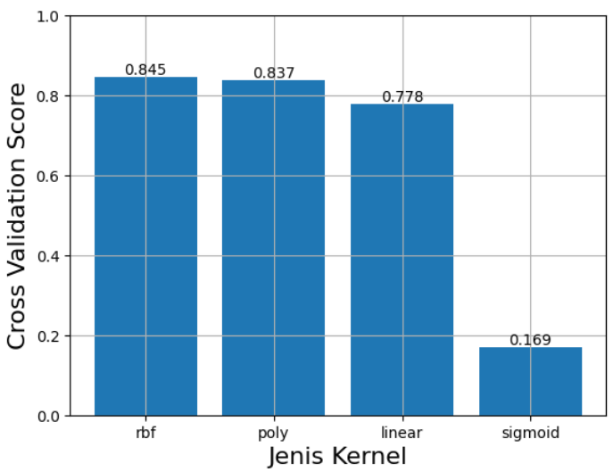
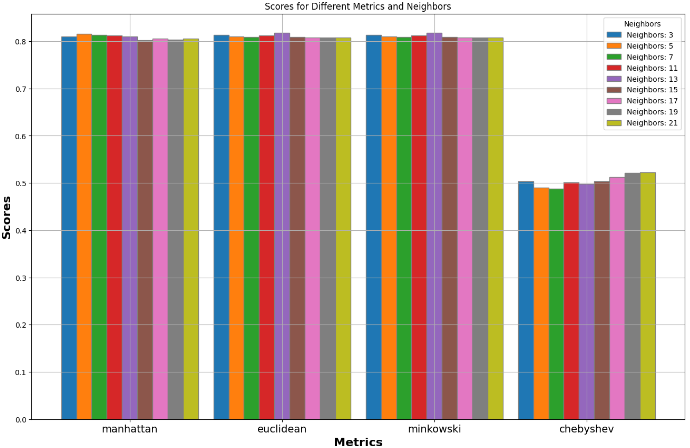
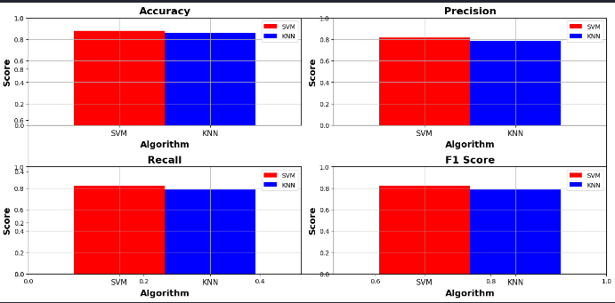
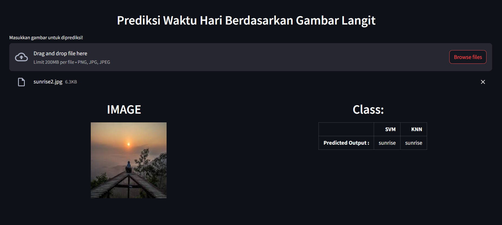

## About This Project
In this project, I implement Machine Learning algorithms such as K-Nearest Neighbor (KNN) and Support Vector Machine (SVM) to classify time of day that has 3 main classes (**daytime**, **nighttime**, and **sunrise**). The aim of this project is to compare performance from those 2 algorithms. We use K-Fold Cross Validation with cv = 5 to validate our model. Before that, we also preprocess the images using **Smoothing**, **Sharpening**, and **Resizing**.

## Getting Started for Model
*__Requirements__*
Ensure you have the following dependencies installed on your system:
-  Python: <mark>version 3.10.x</mark>

#### Installation
1. Change to the model directory:
```bash
cd model
```
2. install the dependencies:
```bash
pip install -r requirements.txt
```
3. Running the **project.ipynb** with Jupyter Notebook.
4. Move the models file (**.pkl**) to the **ui** directory.


## Getting Started for User Interface
*__Requirements__*
Ensure you have the following dependencies installed on your system:
-  Python: <mark>version 3.10.x</mark>
#### Installation
1. Change to the ui directory:
```bash
cd ui
```
2. Install the dependencies:
```bash
pip install -r requirements.txt
```
3. Before run the streamlit, make sure that you have dump the models (knn_model.pkl and svm_model.pkl) in the **model/project.ipynb** and move the models file into **ui** folder.
4. Run the streamlit:
```bash
streamlit run streamlit_app.py
```

## Documentation

<br />

<br />

<br />

<br />

